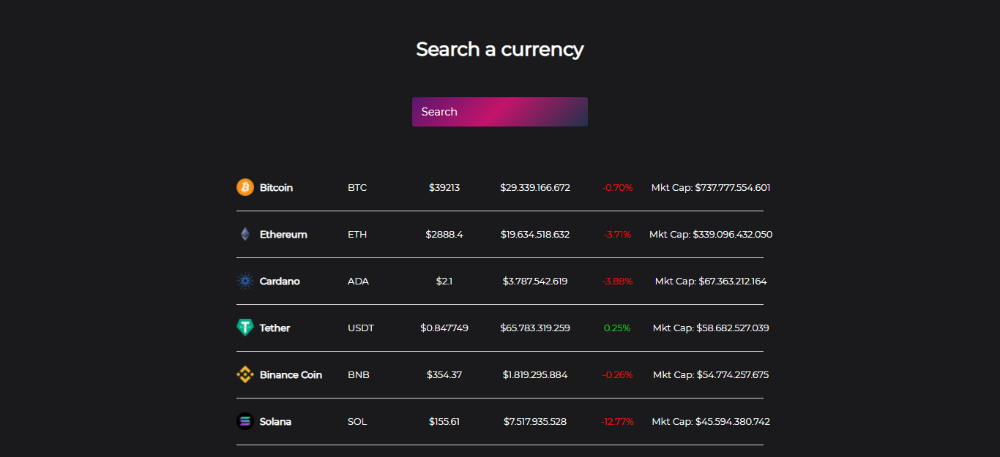
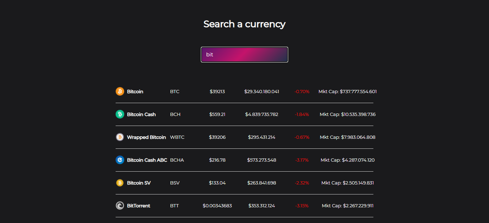

# Cryptocurrency React
Cryptocurrency Price REST API written React. This project has been created using the [Coingecko API](https://www.coingecko.com/es). It provides quick access to market data for storage, analysis and visualization. With this app we allow you to search by the name of your cryptocurrency and find the information you are looking for.

## Display

